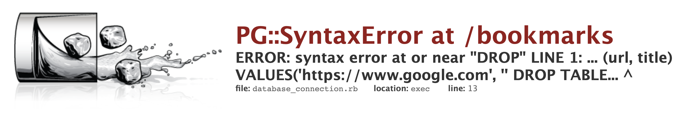

# Walkthrough - Securing Your App

[Back to Challenge](../12_securing_your_app.md)

### Finding the vulnerability

To perform an SQL injection, we need to find a place in the codebase where user input is used to create an SQL query. At present, the application is small and there's only one such place and it's in `bookmark.rb`.

```ruby
def self.create(url:, title:)
    if ENV['ENVIRONMENT'] == 'test'
     connection = PG.connect(dbname: 'bookmark_manager_test')
    else
     connection = PG.connect(dbname: 'bookmark_manager')
    end

    result = connection.exec("INSERT INTO bookmarks (url, title) VALUES('#{url}', '#{title}') RETURNING id, title, url;")
    Bookmark.new(id: result[0]['id'], title: result[0]['title'], url: result[0]['url'])
end
```

In this method, we're taking user input (`url` and `title`) from the new bookmark form and inserting it into an SQL query string template.

If someone added the right snippet of SQL into one of those two form fields, that SQL would be inserted and executed – we've **found the vulnerability!**

### Developing a malicious SQL snippet

We're to perform an SQL attack that will cause the `bookmarks` table to be dropped, so we want to inject `DROP TABLE bookmarks`. What happens if you fill in the form using `DROP TABLE bookmarks` as the title?  Give it a try before you read on!

You get a new bookmark with the title of **DROP TABLE bookmarks**, right? And now, if there was one, the site administrator would be forewarned of your plan! Why did that not work as intended? Let's look at the SQL query that would have been generated if you chose to use `https://www.makers.tech` ad the URL.

```ruby
"INSERT INTO bookmarks (url, title) VALUES('https://www.makers.tech', 'DROP TABLE bookmarks') RETURNING id, title, url;"
```

What went wrong? When your SQL snippet was interpolated into the query string template, it was inserted between two single quotes. This meant the SQL snippet was used as a valid title, rather than being executed as SQL.  Here's the SQL that was executed.

```sql
INSERT INTO bookmarks (url, title) VALUES('https://www.makers.tech', 'DROP TABLE bookmarks') RETURNING id, title, url;
```

**How can you make the app execute your malicious SQL snippet?**

The first step is to write a new SQL snippet that can close the single quotes in the SQL query string template. Try using `' DROP TABLE bookmarks` as your title.  What happens this time?  You should see an error like this. Read the top part carefully.  Where does the error come from?



If you guessed that the error comes from Postgres, you're absolutely right and this is good news because it shows that we're starting to disrupt the SQL query string.

The next step is to resolve the Postgres error because it halts execution before our SQL snippet can work is evil magic. How do we do that? We must ensure that everything before `DROP TABLE` is valid as an SQL query.  We just caused this to be generated, leaving a malformed INSERT query. It is malformed because the arguments to `VALUES` are not valid.

```sql
INSERT INTO bookmarks (url, title) VALUES('https://www.makers.tech', '' DROP TABLE bookmarks') RETURNING id, title, url;
```

How do we fix this? Since it was possible inject `'` and close the single quotes, can we inject `)` to close the INSERT query?  Give it a try! The new 'title' should be `') DROP TABLE bookmarks`. What happens now? You should see this and if you look closely, you'll see that there's a small but reassuring difference between what you see now and the previous error message.  The error message shows us that the brackets have been closed.


This time, we forced an SQL query like this. Which is definitely progress.

```sql
INSERT INTO bookmarks (url, title) VALUES('https://www.makers.tech', '') DROP TABLE bookmarks') RETURNING id, title, url;
```

Can you see what the issue is now? If not, imagine trying to execute this SQL in psql. First you're trying to create a bookmark, then you're trying to drop a table. You'd execute them as two separate queries – and what would come between them?

If you guessed that we need one of these `;` you're correct! The new 'title' is `'); DROP TABLE bookmarks`.  Give it a try.  What happens now? You should see this error.


Again, the difference is subtle but if you read it carefully, you'll see that the error message is different to the previous one we saw. This time we see that the `;` has been injected and the second query with our `DROP TABLE` command is being executed but now there's a problem there.  This is what the SQL looks like.

```sql
INSERT INTO bookmarks (url, title) VALUES('https://www.makers.tech', '') DROP TABLE bookmarks') RETURNING id, title, url;
```

When we break it on to two lines, it's easier to see that the second query is malformed.

```sql
INSERT INTO bookmarks (url, title) VALUES('https://www.makers.tech', '');
DROP TABLE bookmarks') RETURNING id, title, url;
```

Since we're purely interested in dropping that `bookmarks` table, we don't care about anything which comes after that.  If you were working with Ruby and had this to fix this invalid code snippet by inserting one or more characters, what would you do?

```ruby
puts "Hello, World" how are you today?
```

One way of fixing it would be to insert a `#` and turn the invalid part into a comment, like so.

```ruby
puts "Hello, World" # how are you today?
```

Can you do this with SQL? Sure you can! SQL comments are marked `--` so we can add that into our SQL snippet and the new 'title' is `');DROP TABLE bookmarks; --`.  What happens now? You should see this error.


### Verifying that the table is gone

There are two ways of verifying that the bookmarks table has definitely been dropped.

#### 1. Try to create a new bookmark

If you go back to the form and enter a regular `url` / `title`, you should see this error which tells you that the bookmarks table can no longer be found.

  

#### 2. Examine the database in a psql session

If you now start a new psql session, connect to the DB and list out the tables, you should see that the `bookmarks` table no longer exists.

  - To start a new psql session do this in your terminal `psql`
  - Then connect to the database like this `\c bookmark_manager`
  - And display the list of tables like this `\dt`

### Defending against SQL injection

If you google `SQL injection PG gem ruby` one of the top hits will be [this page](https://www.rubydoc.info/gems/pg/PG%2FConnection:exec_params). Give it a glance over and then search for the text `injection` and you'll learn that `#exec_params`, an alternative to `#exec`, protects against SQL injection.  So that's your fix, but how do you use it? The docs may seem a little unclear. First, let's remind ourselves of what you already have.

```ruby
def self.create(url:, title:)
    if ENV['ENVIRONMENT'] == 'test'
     connection = PG.connect(dbname: 'bookmark_manager_test')
    else
     connection = PG.connect(dbname: 'bookmark_manager')
    end

    # This next line is the crucial one, where
    result = connection.exec("INSERT INTO bookmarks (url, title) VALUES('#{url}', '#{title}') RETURNING id, title, url;")
    Bookmark.new(id: result[0]['id'], title: result[0]['title'], url: result[0]['url'])
end
```

Let's now change that to use `#exec_params`.  The new method takes two arguments, the SQL query template and the params to be inserted, as an array. Refactor your solution to use `#exec_params` as below and verify that the application still works by trying to add a bookmark in the normal fashion.  Then, try SQL injection again and you should end up with a new bookmark with the title of `');DROP TABLE bookmarks; --`.  If so, your app is now protected against SQL injection!

```ruby
def self.create(url:, title:)
    if ENV['ENVIRONMENT'] == 'test'
     connection = PG.connect(dbname: 'bookmark_manager_test')
    else
     connection = PG.connect(dbname: 'bookmark_manager')
    end

    # I've broken it on to twp lines to make it a bit more readable
    result = connection.exec_params(
      # The first argument is our SQL query template
      # The second argument is the 'params' referred to in exec_params
      # $1 refers to the first item in the params array
      # $2 refers to the second item in the params array
      "INSERT INTO bookmarks (url, title) VALUES($1, $2) RETURNING id, title, url;", [url, title]
    )
    Bookmark.new(id: result[0]['id'], title: result[0]['title'], url: result[0]['url'])
end
```

[Next Challenge](../13_deleting_bookmarks.md)

<!-- BEGIN GENERATED SECTION DO NOT EDIT -->

---

**How was this resource?**  
[😫](https://airtable.com/shrUJ3t7KLMqVRFKR?prefill_Repository=course&prefill_File=bookmark_manager/walkthroughs/12.md&prefill_Sentiment=😫) [😕](https://airtable.com/shrUJ3t7KLMqVRFKR?prefill_Repository=course&prefill_File=bookmark_manager/walkthroughs/12.md&prefill_Sentiment=😕) [😐](https://airtable.com/shrUJ3t7KLMqVRFKR?prefill_Repository=course&prefill_File=bookmark_manager/walkthroughs/12.md&prefill_Sentiment=😐) [🙂](https://airtable.com/shrUJ3t7KLMqVRFKR?prefill_Repository=course&prefill_File=bookmark_manager/walkthroughs/12.md&prefill_Sentiment=🙂) [😀](https://airtable.com/shrUJ3t7KLMqVRFKR?prefill_Repository=course&prefill_File=bookmark_manager/walkthroughs/12.md&prefill_Sentiment=😀)  
Click an emoji to tell us.

<!-- END GENERATED SECTION DO NOT EDIT -->
