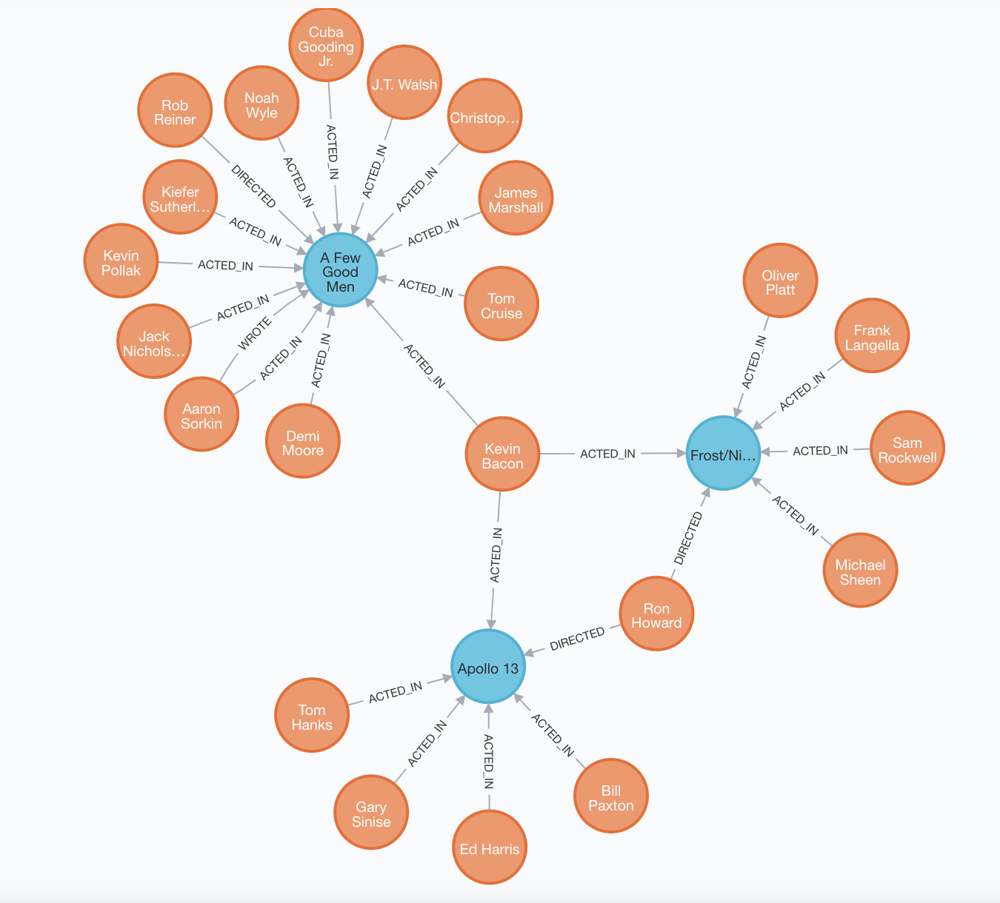

# Introducing Databases

In web week, you built several web applications that all featured the same limitation – they were unable to persist data. One solution, would have been to write-to and read-from a text or CSV file. This would certainly work for simple use cases and is, indeed, an approach you might take if you were doing data analysis. For anything beyond the most simple possible web application, however, that approach would be quite inefficient and prone to serious errors.

Instead, people use databases which are, fundamentally, still files on your computer but they exist within a highly specialised system that allows you to write and read with speed and reliability.  Several families of database exist.

In learning a little bit about each one, you will address this apprenticeship standard point: **K10: Principles and uses of relational and non-relational databases**.

## Relational Databases

This week, you’ll be using **relational databases** where the data is organised into tables, with rows and columns, and you’ll use Structured Query Language (SQL) to write, read, update and delete records (rows).  One of the main disadvantages of relational databases is that changing the structure of the database can be slow, complex and fraught with the risk of losing data.  Large companies will sometimes spend weekends or late nights doing this (to minimise disruption to their customers) and the process may take several hours.

> Here's an example of a `users` table (aka relation) from a relational database.  It's called a relational database because related data is grouped together.  I.e. The `name`, `email` and `password` of a single user are grouped together on the same row.

|id| name         | email            | password  |
|--|--------------|------------------|-----------|
|01| Fiona        | fiona@gmail.com  | kangaroo  |
|02| Terry        | terry@yahoo.com  | giraffe   |
|03| Susie        | susie@email.com  | crocodile |

## Non-Relational Databases

There’s also a superfamily called **non-relational databases**.  You’ll not use any of these this week, but it’s important that you know they exist and, depending on which track you follow, you might use one of them (most likely a document database) in the coming weeks.  The most commonly used non-relational databases are key/value stores, document databases and graph data stores.  I’ll introduce each one below.

### Key/value data stores

Key-value data stores are basically a big hash – you associate each of your values with a unique key that can be used, later on, to retrieve the value.  The main advantages of a key/value data store are speed (it’s extremely quick to read and write data) and flexibility (you don’t have to change the schema when your data structures change).  Though it’s not a plain key/value data store, because you can a wide variety of data structures as the values, Redis is likely to be the first thing that comes to most people’s minds when talking about key/value data stores.

> Here's an example of a key/value data store which currently contains 4 keys and 4 values. On first glance it seems like the key/value pairs in this example are all related but there's nothing in the database structure that reflects this. They're just a bunch of key/value pairs.

|key|value           |
|---|----------------|
|001| +447876555555  |
|002| Freda Fitch    |
|003| 22 High Street |
|004| Bananas        |


> QUESTION: Why is reading from a key/value data store so efficient?

### Document databases

**Document databases**, store data in collections of documents often using JSON (Javascript Object Notation).  The main advantages of document databases is that they are more flexible, compared to relational databases, and scale better. Getting into the details of their scalability requires us to dive deep into database theory, which is interesting but not entirely necessary right now. MongoDB is a very popular document database.

> Here's an example of collection (let's call it `people`) from a document database. The two documents (each one corresponding to one person) have different properties... which may seem odd but our document database doesn't care about that.

```json
[
  {
    "firstName": "Bob",
    "address": "5 Oak St.",
    "hobby": "sailing",
    "pets": ["cat", "dog", "ferret"]
  },
  {
    "firstName": "Janet",
    "address": "10 Cedar St.",
    "hobby": "karate",
    "job title": "CEO"
  }
[
```

### Graph databases

**Graph databases** store data in the form of, you guessed it, a graph!  On that graph, records are stored as nodes and the relationships between them as edges or vertices.  Proponents of graph databases argue that storing data as a graph helps with development speed because it more closely resembles the way in which devs and clients will think about the data.  I.e. Less effort is required when it comes to ‘translating’ to, and from, the whiteboard.  Graph database query languages also allow you to examine deeply nested relationships without writing a hundred lines of code. Neo4J is a popular graph database.

> Here's an example of a graph database visualisation. Note how easy it is to see the relationships between different people and any given film or any other person, via a film.



## Test your understanding

For each of these scenarios, decide which type of database should be used and do a basic diagram of what the database would look like.

#### Storing web sessions
You’re building a web app and want to store user sessions on your server.  The server will look for a session_id in every request and, if there is one, it’ll retrieve the associated session from a database.  The session will contain the user_id of whoever is logged in and whatever else the developers choose to put in there.  There’s no need to create relationships between different sessions.

#### Banking transactions
The app you’re designing will be used to track banking transactions, so it’s critical that the data is 100% accurate and that any changes are reflected immediately on all devices.

#### A recommendation system
To compete with Netflix, MakersFlix needs to up their game when it comes to making recommendations.  If they can improve their recommendation engine by 10%, they’ll retain significantly customers and start to break even. A great recommendation system needs to call on a huge number of different data points.  Furthermore, they need to move fast and get the prototype rolled out in the next few weeks.

#### A publication platform
For your publication platform, you'll have a page for each author which shows all of their publications.  You won't also have a single page that shows all publications by all authors.  In addition, you need some flexibility because new publication types, with different properties, are likely to emerge in future.

<!-- BEGIN GENERATED SECTION DO NOT EDIT -->

---

**How was this resource?**  
[😫](https://airtable.com/shrUJ3t7KLMqVRFKR?prefill_Repository=course&prefill_File=pills/databases.md&prefill_Sentiment=😫) [😕](https://airtable.com/shrUJ3t7KLMqVRFKR?prefill_Repository=course&prefill_File=pills/databases.md&prefill_Sentiment=😕) [😐](https://airtable.com/shrUJ3t7KLMqVRFKR?prefill_Repository=course&prefill_File=pills/databases.md&prefill_Sentiment=😐) [🙂](https://airtable.com/shrUJ3t7KLMqVRFKR?prefill_Repository=course&prefill_File=pills/databases.md&prefill_Sentiment=🙂) [😀](https://airtable.com/shrUJ3t7KLMqVRFKR?prefill_Repository=course&prefill_File=pills/databases.md&prefill_Sentiment=😀)  
Click an emoji to tell us.

<!-- END GENERATED SECTION DO NOT EDIT -->
